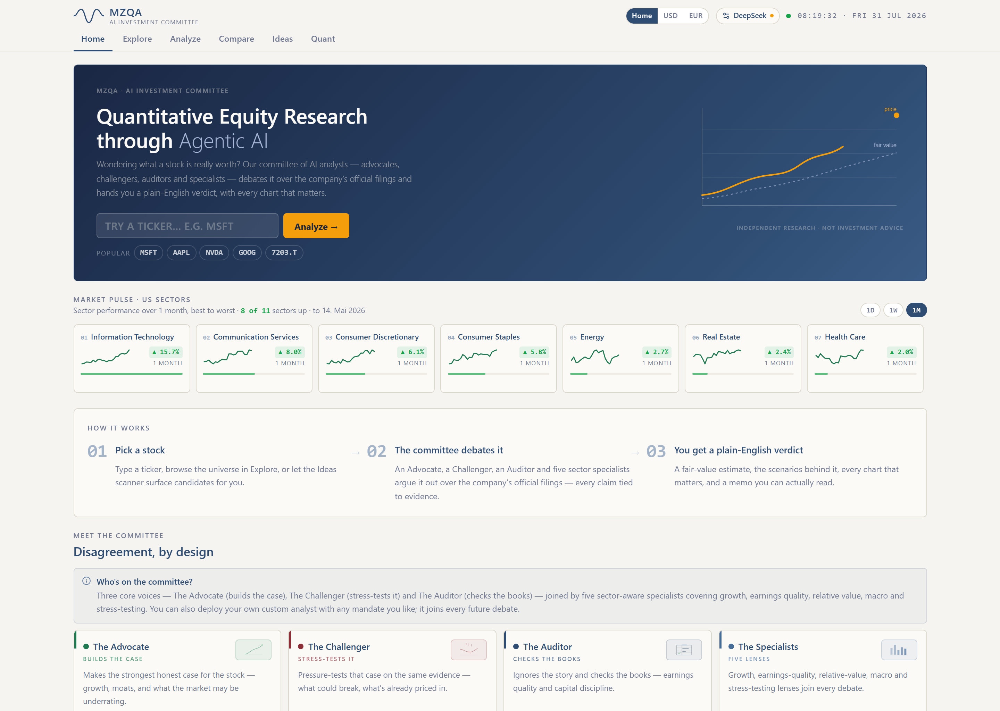
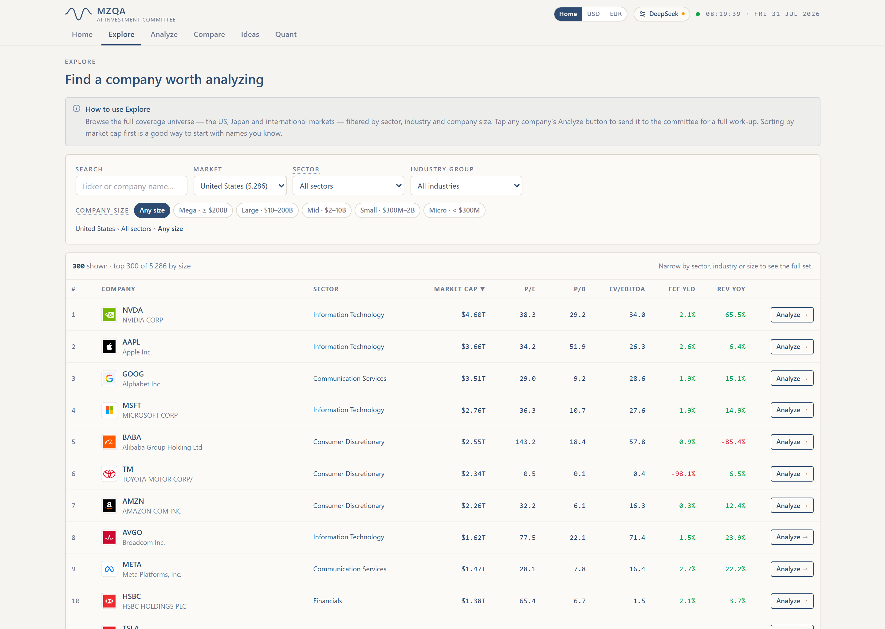
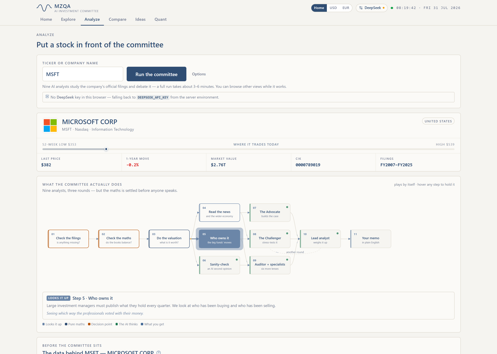
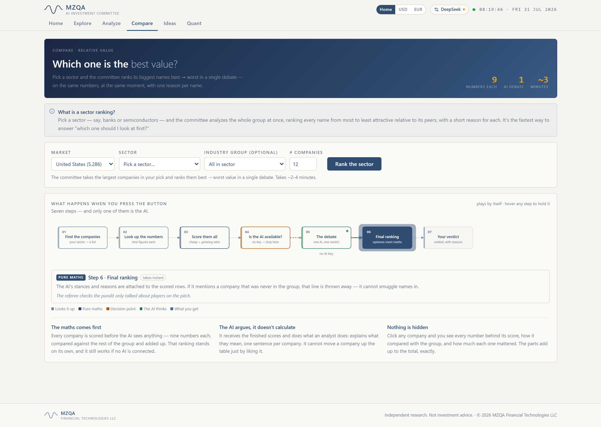
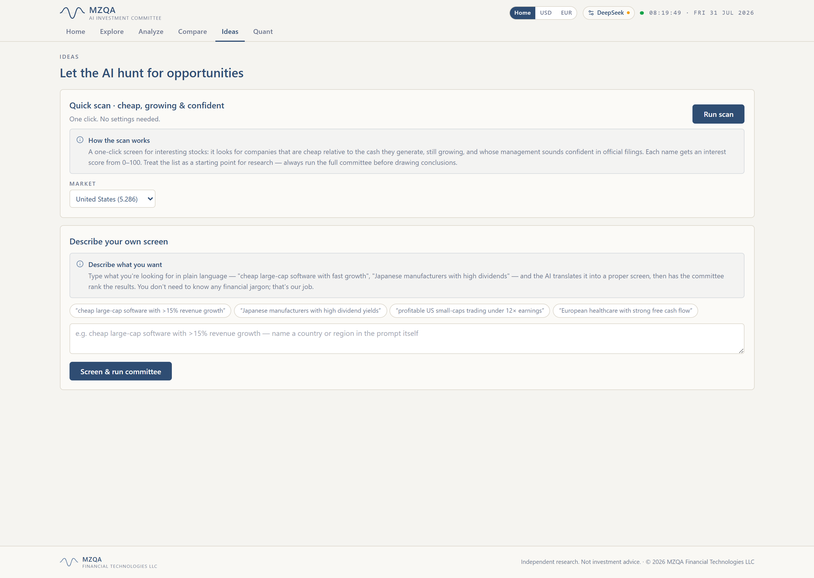
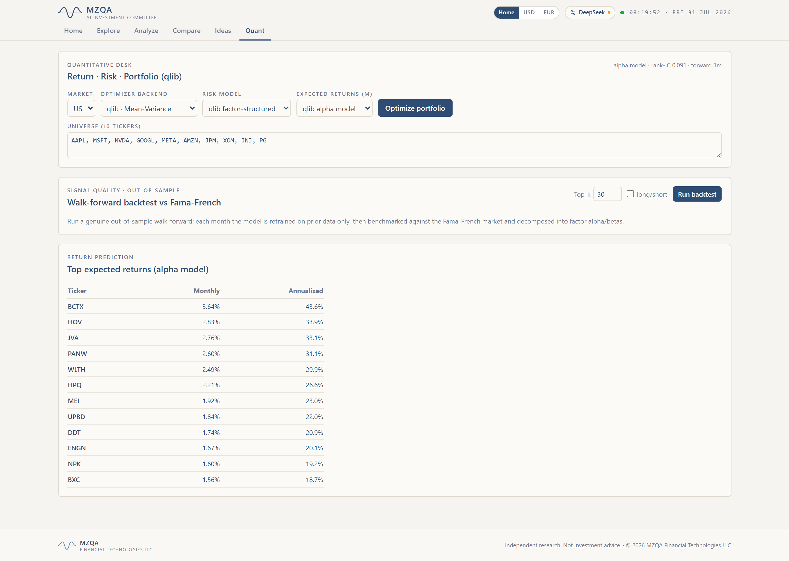

# AI_Analyst — standalone Investment Committee

A self-contained app that runs the MZQA multi-agent **investment committee** (Bull · Bear ·
Forensic Auditor · sector-aware specialist archetypes · Lead → memo) on:

- **Single stock** — the full tribunal + institutional report for one ticker.
- **Industry (GICS)** — a single relative-value verdict across a GICS sector / industry group.
- **AI screen** — a natural-language screen, plus a one-click **Value + Sentiment** agent that
  scans for interesting, cheap stocks and overlays management tone read from each name's MD&A.

It is carved out of the MZQA Equity Terminal and carries all the code it needs. The one thing it
does **not** carry is the market/fundamentals data: it connects to the existing (read-only)
Postgres `xbrl_sec` warehouse produced by the data pipeline.

## Screenshots

A look at the six-view frontend (US coverage shown). Full-size images live in
[`screenshots/`](screenshots/).

| Home — the landing hero | Explore — coverage universe with company logos |
|---|---|
| [](screenshots/01-home.png) | [](screenshots/02-explore.png) |
| **Analyze — a single name (MSFT)** | **Compare — relative-value sector ranking** |
| [](screenshots/03-analyze-msft.png) | [](screenshots/04-compare.png) |
| **Ideas — natural-language & quick screen** | **Quant — qlib return · risk · portfolio** |
| [](screenshots/05-ideas.png) | [](screenshots/06-quant.png) |

## Architecture

```
AI_Analyst/
├─ backend/                 FastAPI + the committee engine + the xbrl_sec data layer
│  ├─ api/                  routers: meta (GICS), screener, screener_agent, ai_committee, ai_committee_group
│  ├─ ai_analyst/committee/ the LangGraph tribunal, valuation, group + value-sentiment logic
│  └─ xbrl_sec/             data layer (DB, LLM client, MD&A, news) — read path only
├─ frontend/                Next.js 14 app — the tabbed committee UI
├─ start_committee.bat      one-click launcher (backend + frontend)
└─ .env.example             config template (defaults work for a local Postgres)
```

- **Backend:** FastAPI (async) on `:8027`; the committee runs on worker threads (psycopg2 +
  blocking HTTP). Five LLM providers are supported — DeepSeek, ChatGPT (OpenAI), Claude
  (Anthropic), Moonshot and Gemini — selected per request. Each has a fast chat tier for
  structured extraction and a deep tier for narrative (e.g. `deepseek-chat`/`deepseek-reasoner`,
  or `claude-opus-4-8` with adaptive thinking). The registry lives in `backend/llm_providers.py`.
- **Frontend:** Next.js 14 / React 18 / Tailwind on `:3027`, talking to the backend.
- **Database:** the existing Postgres `xbrl_sec` (schema `sec`). **Read-only** — the app never
  writes to it. Custom analyst types are persisted client-side (browser localStorage). Schema
  setup and the data-acquisition/update pipeline (SEC/EDINET filings, Yahoo intl equities,
  prices, MD&A, 13F/insider, news, macro/factor data, ETFs) are documented in
  [`docs/data_pipeline.md`](docs/data_pipeline.md) — that tooling is separate, manual CLI
  work, not something the running app triggers.

## Setup

```powershell
cd AI_Analyst

# 1) Backend venv + deps (lean set — no torch/dash; see backend/requirements.txt)
py -3 -m venv .venv
.\.venv\Scripts\pip install -r backend\requirements.txt

# 2) Frontend deps
cd frontend; npm install; cd ..

# 3) Point at the existing Postgres + keys (once, from any terminal)
setx PGPASSWORD "your-postgres-password"
setx DEEPSEEK_API_KEY "sk-your-key-here"     # optional; can also paste in the UI
# Other providers use OPENAI_API_KEY / ANTHROPIC_API_KEY / MOONSHOT_API_KEY / GEMINI_API_KEY.
# Set AI_ANALYST_LLM_PROVIDER to change the server-side default (defaults to deepseek).
# Users can instead paste keys under Setup in the app: they are kept in the browser
# session only and erased when the browser closes.

# 4) No warehouse yet? Create the schema and load data — see docs/data_pipeline.md
python -m xbrl_sec.sec.cli apply-schema

# 4) (optional) copy .env.example -> .env to override DB host/schema
```

## Run

```powershell
.\start_committee.bat        # starts both services, opens http://127.0.0.1:3027
```

Or manually:

```powershell
# backend (from AI_Analyst/)
$env:PYTHONPATH="$PWD\backend"; $env:MZQA_SKIP_SCHEMA="1"
.\.venv\Scripts\python -m uvicorn api.main:app --host 127.0.0.1 --port 8027

# frontend (from AI_Analyst/frontend)
npm run dev                  # opens on http://127.0.0.1:3027
```

Committee CLI (no browser, token-free smoke test):

```powershell
$env:PYTHONPATH="$PWD\backend"
.\.venv\Scripts\python -m ai_analyst.committee.run --ticker MSFT --offline --no-news
```

## Notes

- **Data-governance gate is advisory by default.** A committee run proceeds even when the
  standardized financials fail a core accounting identity, surfacing the findings as a warning
  banner. Tick **Strict data-governance** on the Single-stock tab to restore the hard block.
- **DCF horizon is 7 years** (explicit forecast), consistent across the consolidated DCF, the
  SOTP segment DCF, the sensitivity grid and the reverse-DCF.
- **Specialist archetypes run automatically.** Growth Extrapolator, Quality-of-Earnings Auditor,
  Relative-Value Arbitrageur, Macro-Regime Strategist and Sensitivity Stress-Tester join the
  single-stock graph and inform group/screen deliberations by default; use
  `config.specialist_analyst_mode="none"` or an explicit `config.specialist_analysts` list to override.
- **Add-analyst is explicit + persistent.** Fill name + mandate and click **Apply / Deploy
  analyst**; the roster persists in your browser and joins every run (single / industry / screen).
- **MD&A sentiment coverage:** the value-sentiment agent scores management tone from
  `fact_mda_sections_*`. US coverage is currently sparse (~47 companies); Japan is much richer.
  Where a name has no MD&A/news, the composite falls back to valuation + growth and says so.
