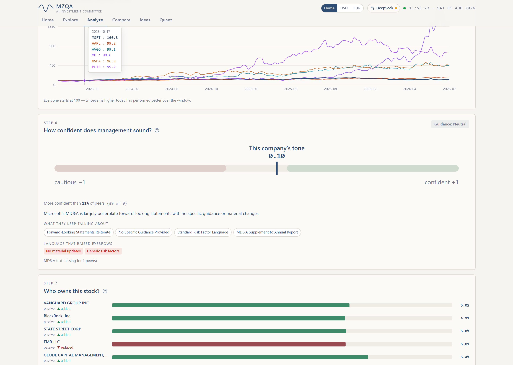
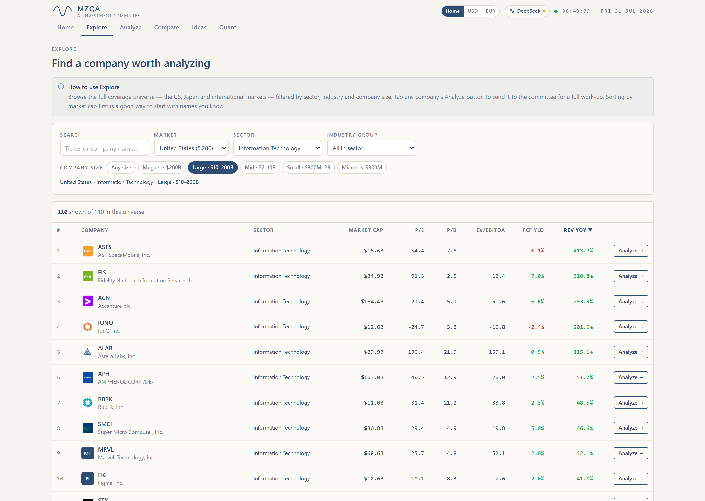

# Screenshots

Captures of the AI_Analyst frontend (Next.js, `frontend/`), taken against live
US warehouse data at 1440×1024 (2× DPI). Independent research, **not** investment
advice; figures in the run outputs are as of the run date.

## The five-view tour

One capture per view.

| File | View | What it shows |
|---|---|---|
| `01-home.png` | Home | Landing hero + live "market pulse" sector strip + how-it-works |
| `02-explore.png` | Explore | Coverage-universe browser with per-company brand logos |
| `03-analyze-msft.png` | Analyze | A single name worked up by the committee — MSFT (Microsoft) |
| `04-compare.png` | Compare | Relative-value sector ranking setup |
| `05-ideas.png` | Ideas | One-click quick scan + natural-language screen |
| `06-quant.png` | Quant | qlib return / risk / portfolio desk with alpha-model predictions |

## Example run outputs

Real outputs from a live **MSFT** run (US market, DeepSeek).

### Single-stock committee (Analyze)

| Verdict | The debate | Tone &amp; ownership |
|---|---|---|
|  |  |  |

- **committee-verdict.png** — the committee's bottom line: fair value vs price, estimated up/downside, data-confidence, and the downside→upside scenario band.
- **committee-debate.png** — all nine analysts (Advocate · Challenger · Auditor + Growth, Macro-Regime, Quality-of-Earnings, Quant-Factor, Relative-Value and Sensitivity specialists), each with a number-backed thesis and specific risk flags.
- **committee-tone-ownership.png** — management-tone score read from the MD&amp;A, plus 13F institutional ownership.

### Screener &amp; Quant

| Screener | Portfolio optimize | Walk-forward backtest |
|---|---|---|
|  |  |  |

- **screener.png** — Explore, filtered to US Information Technology large-caps, ranked by revenue growth.
- **quant-optimize.png** — mean-variance portfolio optimization (qlib alpha model) over 30 US tickers.
- **quant-backtest.png** — genuine out-of-sample walk-forward vs the Fama-French market, with the FF5 + momentum factor decomposition.

---

Regenerate the view tour after UI changes with the puppeteer script kept in the
scratchpad (`shots.js`) while the backend (`:8027`) and frontend (`:3027`) are
running — it drives the six views and re-saves the numbered files.
