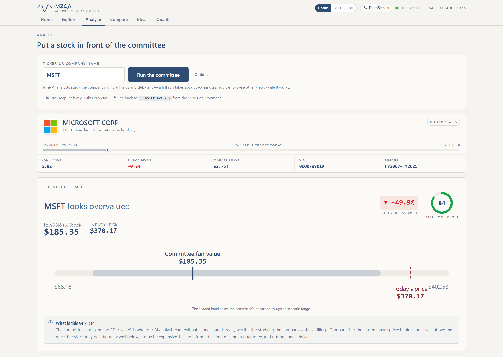
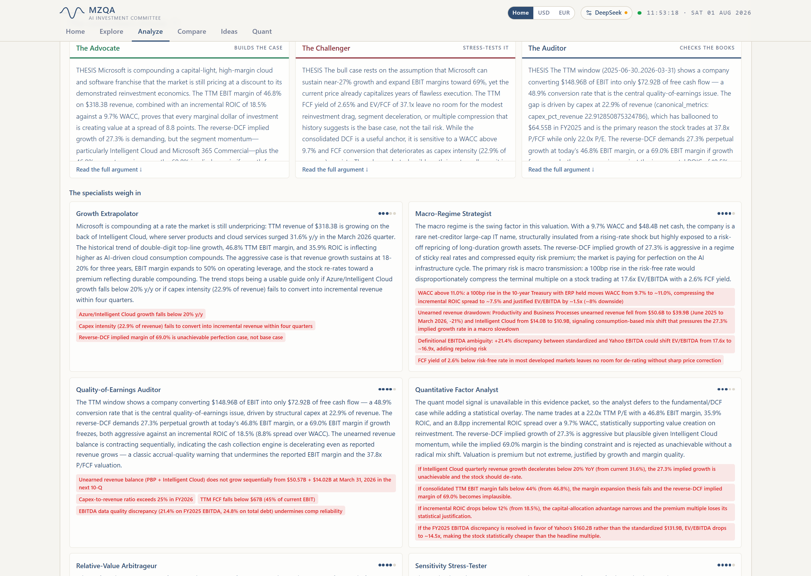
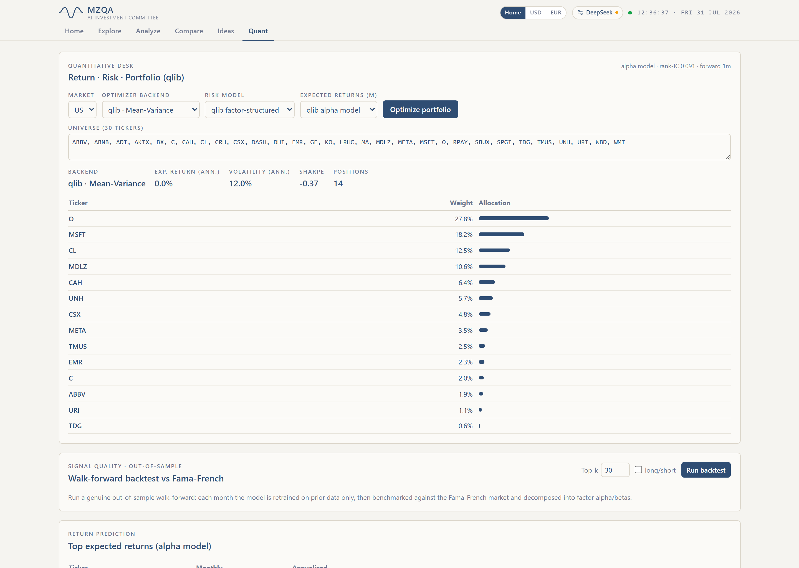
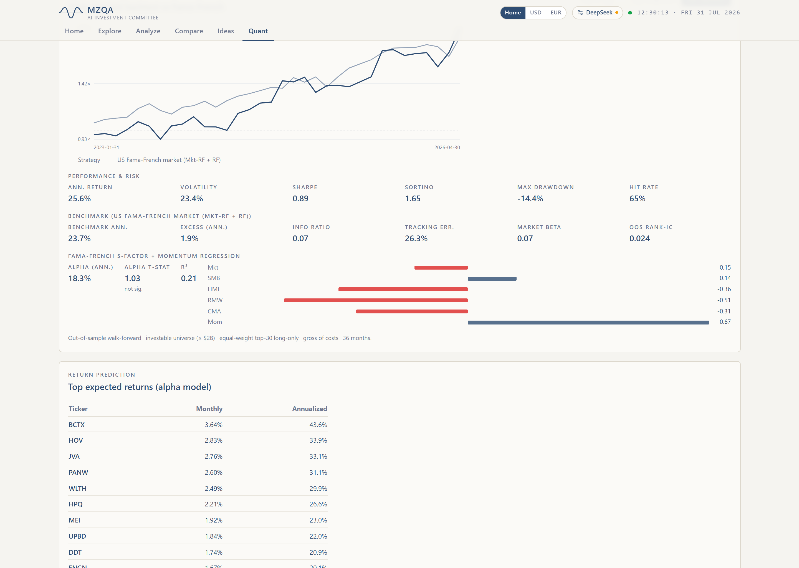

# Example outputs

Real outputs from a live run of the app — **MSFT**, US market, on DeepSeek —
captured at 1440×1024 (2× DPI). Illustrative of what each analysis produces.
Independent research, **not** investment advice; figures are as of the run date.

### Single-stock committee (Analyze)

| Verdict | The debate | Tone &amp; ownership |
|---|---|---|
|  |  |  |

- **committee-verdict.png** — the committee's bottom line: fair value vs price, estimated up/downside, data-confidence, and the downside→upside scenario band.
- **committee-debate.png** — all nine analysts (Advocate · Challenger · Auditor + Growth, Macro-Regime, Quality-of-Earnings, Quant-Factor, Relative-Value and Sensitivity specialists), each with a number-backed thesis and specific risk flags.
- **committee-tone-ownership.png** — management-tone score read from the MD&amp;A, plus 13F institutional ownership.

### Screener &amp; Quant

| Screener | Portfolio optimize | Walk-forward backtest |
|---|---|---|
|  |  |  |

- **screener.png** — Explore, filtered to US Information Technology large-caps, ranked by revenue growth.
- **quant-optimize.png** — mean-variance portfolio optimization (qlib alpha model) over 30 US tickers.
- **quant-backtest.png** — genuine out-of-sample walk-forward vs the Fama-French market, with the FF5 + momentum factor decomposition.
